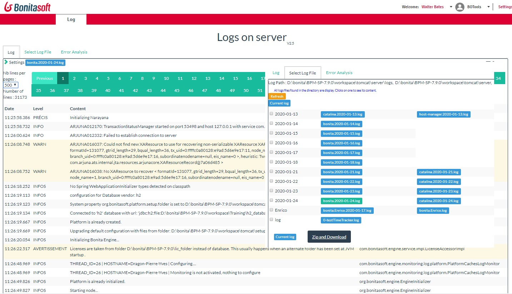

# page_log
Access the log file
The page display the different log file detected on the server, and clicking on a file, you display the log.

It's possible to filter on error, or to search in the log some information.

Clicking the "automatic refresh" is usefull to view the log in real time.

